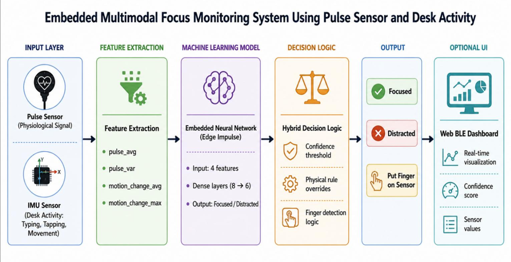
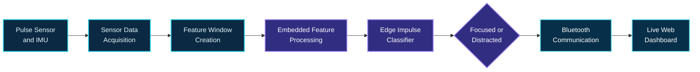
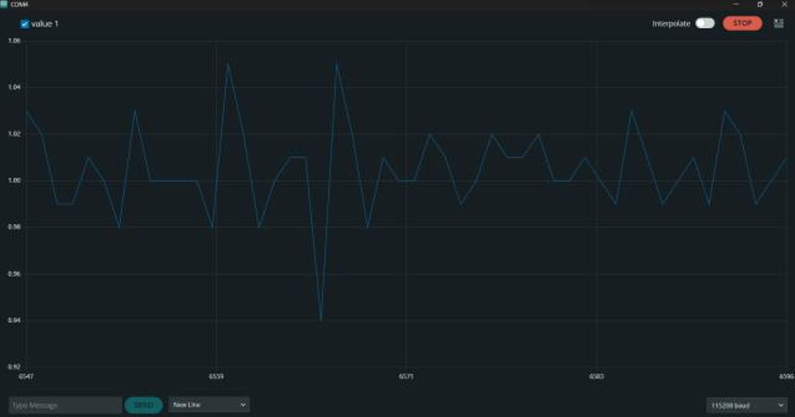
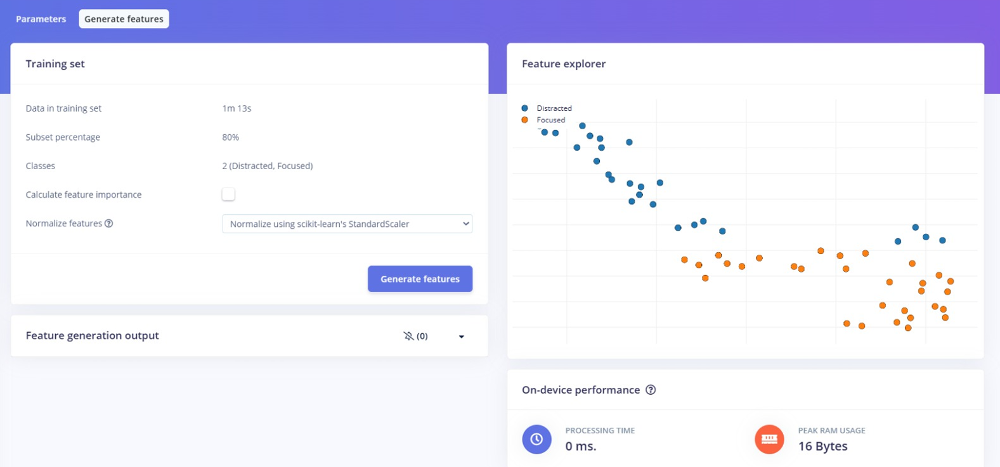
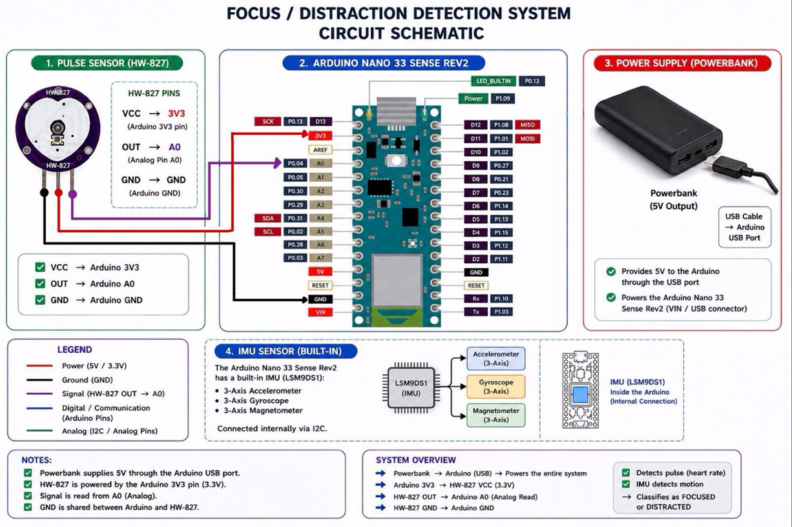
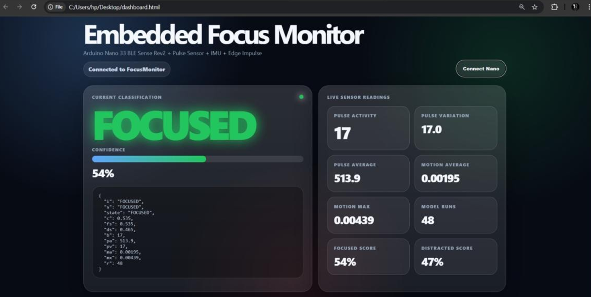
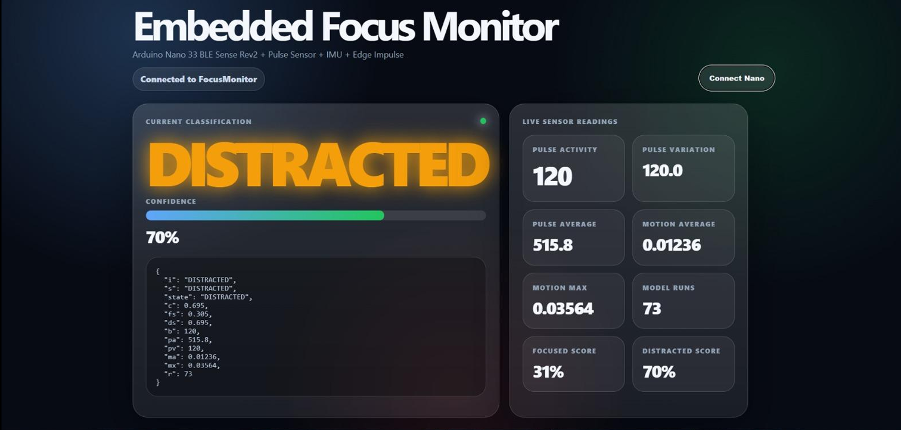
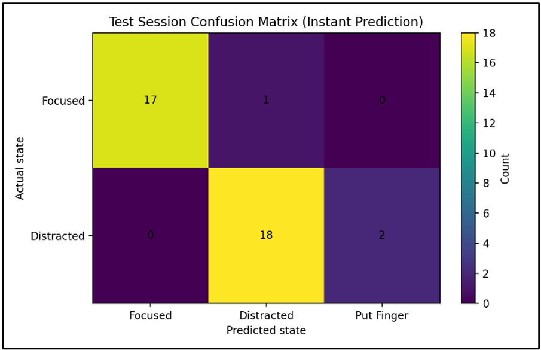

<div align="center">


<a href="#project-snapshot"></a>

[](#hardware-platform)
[](#edge-impulse-model-training)
[](#performance-results)
[](#live-dashboard)

### Real-time focus-state classification using pulse and motion signals on Arduino Nano 33 BLE Sense

</div>

## Project introduction

**Embedded AI Focus Monitor** is a real-time, non-wearable focus-state monitoring prototype that combines physiological and motion-based sensor data. Pulse readings and IMU motion analysis feed an embedded machine-learning model trained with Edge Impulse and deployed directly to an Arduino Nano 33 BLE Sense Rev2.

The system classifies the current state as **focused** or **distracted**, then presents the prediction, confidence, pulse activity, and motion readings through a live Web Bluetooth dashboard.

> [!NOTE]
> This is an educational embedded AI prototype. Its classifications are engineering outputs derived from limited sensor signals—not medical conclusions or perfect measurements of attention.

## Project snapshot

<table>
  <tr>
    <td width="24%"><strong>Hardware</strong></td>
    <td>Arduino Nano 33 BLE Sense Rev2 and HW-827 pulse sensor</td>
  </tr>
  <tr>
    <td><strong>Signals</strong></td>
    <td>Pulse, accelerometer, gyroscope, and desk movement</td>
  </tr>
  <tr>
    <td><strong>Model</strong></td>
    <td>Edge Impulse embedded classifier</td>
  </tr>
  <tr>
    <td><strong>Classes</strong></td>
    <td>Focused and distracted</td>
  </tr>
  <tr>
    <td><strong>Interface</strong></td>
    <td>Web Bluetooth dashboard</td>
  </tr>
  <tr>
    <td><strong>Accuracy</strong></td>
    <td><strong>92.1%</strong> on evaluated sessions</td>
  </tr>
  <tr>
    <td><strong>Inference</strong></td>
    <td>Real-time execution directly on the embedded device</td>
  </tr>
</table>

## Why the project was built

This project explores how a compact embedded platform can acquire multiple real-time signals, run a lightweight classifier locally, and communicate useful output without relying on continuous cloud inference. It brings together sensor integration, TinyML deployment, Bluetooth communication, and dashboard design in one practical university engineering prototype.

## How it works

1. The pulse sensor and built-in IMU collect physiological and motion signals.
2. Recent sensor readings are grouped into feature windows.
3. The deployed embedded model processes the features.
4. The current state is classified as focused or distracted.
5. The classification result, confidence, and sensor activity are transmitted to the dashboard.
6. The dashboard displays the live monitoring output.

## System architecture

<p align="center">
  
</p>

<p align="center"><sub>Pulse and IMU inputs move through feature extraction, embedded classification, decision logic, and the optional Web Bluetooth interface.</sub></p>

<details>
<summary><strong>View the conceptual workflow</strong></summary>



> This workflow is a conceptual project overview and does not represent the complete internal implementation.

</details>

## Sensor feature extraction

The classifier uses information derived from the project’s available pulse and motion signals, including:

- Pulse sensor activity
- Desk vibration and movement
- Accelerometer changes
- Gyroscope movement
- Missing pulse contact
- Typing and table-tapping activity

These signals can provide useful patterns for this prototype, but they do not provide a medical diagnosis or a perfect measure of human attention.

<p align="center">
  
</p>

<p align="center"><sub>Captured sensor output during project testing.</sub></p>

## Edge Impulse model training

The two-class model was trained using **Edge Impulse** and optimized for deployment on Arduino hardware. Feature visualization was used to inspect separation between focused and distracted activity states. The supplied firmware performs inference directly on the embedded device.

<table>
  <tr>
    <td width="62%" align="center"></td>
    <td width="38%" align="center"></td>
  </tr>
  <tr>
    <td align="center"><sub><strong>Feature visualization</strong> — inspected separation between focused and distracted samples.</sub></td>
    <td align="center"><sub><strong>Model training</strong> — two-class neural-network configuration.</sub></td>
  </tr>
</table>

## Hardware platform

<table>
  <tr>
    <td width="33%" align="center"><strong>Arduino Nano 33 BLE Sense Rev2</strong><br/><sub>Embedded inference, acquisition, and communication platform</sub></td>
    <td width="33%" align="center"><strong>HW-827 Pulse Sensor</strong><br/><sub>Pulse activity input for the monitoring pipeline</sub></td>
    <td width="33%" align="center"><strong>Built-in IMU</strong><br/><sub>Accelerometer and gyroscope motion signals</sub></td>
  </tr>
  <tr>
    <td align="center"><strong>USB Power</strong><br/><sub>Power delivery during development and operation</sub></td>
    <td align="center"><strong>Real-time Acquisition</strong><br/><sub>Continuous pulse and motion signal collection</sub></td>
    <td align="center"><strong>Bluetooth</strong><br/><sub>Communication with the live web interface</sub></td>
  </tr>
</table>

<p align="center">
  
</p>

<p align="center"><sub>Project hardware schematic showing the pulse-sensor connection, Arduino platform, power arrangement, and built-in IMU.</sub></p>

## Live dashboard

The Web Bluetooth dashboard is designed as the real-time observation layer for the embedded system.

<table>
  <tr>
    <td width="33%"><strong>Focused State Monitoring</strong><br/><sub>Displays the model’s focused-state output.</sub></td>
    <td width="33%"><strong>Distracted State Detection</strong><br/><sub>Shows when the distracted class is predicted.</sub></td>
    <td width="33%"><strong>Confidence Scores</strong><br/><sub>Presents model confidence with each classification.</sub></td>
  </tr>
  <tr>
    <td><strong>Pulse Sensor Activity</strong><br/><sub>Visualizes incoming pulse activity.</sub></td>
    <td><strong>Motion Sensor Readings</strong><br/><sub>Surfaces accelerometer and gyroscope activity.</sub></td>
    <td><strong>Embedded Inference Output</strong><br/><sub>Reports live results received from the device.</sub></td>
  </tr>
</table>

<table>
  <tr>
    <td width="50%" align="center"></td>
    <td width="50%" align="center"></td>
  </tr>
  <tr>
    <td align="center"><sub><strong>Focused state</strong> — classification, confidence, and live readings.</sub></td>
    <td align="center"><sub><strong>Distracted state</strong> — classification, confidence, and live readings.</sub></td>
  </tr>
</table>

## Key features

- Real-time focus-state classification
- Embedded on-device AI inference
- Pulse and IMU sensor fusion
- Arduino deployment
- Live Bluetooth-connected dashboard
- Confidence score visualization
- Real-time sensor processing
- Lightweight embedded machine-learning model

## Performance results

<table>
  <tr>
    <td align="center" width="33%"><strong>92.1%</strong><br/><sub>Accuracy</sub></td>
    <td align="center" width="33%"><strong>94.4%</strong><br/><sub>Precision</sub></td>
    <td align="center" width="33%"><strong>89.5%</strong><br/><sub>Recall</sub></td>
  </tr>
</table>

| Result | Confirmed value |
|---|---|
| Accuracy | 92.1% |
| Precision | 94.4% |
| Recall | 89.5% |
| Real-Time Inference | Yes |
| Deployment Platform | Arduino Nano 33 BLE Sense Rev2 |
| Classification | Focused versus Distracted |
| Sensors | Pulse and IMU |

No unconfirmed latency, model-size, memory-use, sample-count, or F1-score values are reported here.

<p align="center">
  
</p>

<p align="center"><sub>Recorded test-session confusion matrix for instant predictions.</sub></p>

## Image gallery

| Project view | What it shows |
|---|---|
| [System architecture](assets/diagrams/system-architecture.png) | Complete signal-to-dashboard workflow |
| [Hardware schematic](assets/hardware/hardware-schematic.png) | Pulse sensor, Arduino, power, and built-in IMU arrangement |
| [Feature visualization](assets/edge-impulse/feature-visualization.png) | Edge Impulse feature explorer |
| [Model training](assets/edge-impulse/model-training.png) | Neural-network training configuration |
| [Focused dashboard](assets/dashboard/focused-state.png) | Focused classification and live telemetry |
| [Distracted dashboard](assets/dashboard/distracted-state.png) | Distracted classification and live telemetry |
| [Sensor output](assets/results/sensor-output.png) | Captured live sensor signal |
| [Confusion matrix](assets/results/confusion-matrix.png) | Test-session instant-prediction outcomes |

## Video demonstrations

<table>
  <tr>
    <td width="50%" align="center"><strong>Complete System Demonstration</strong><br/><sub>End-to-end sensor, inference, and dashboard workflow</sub><br/><br/><code>Video coming after review</code></td>
    <td width="50%" align="center"><strong>Focused State Monitoring</strong><br/><sub>Live focused-state classification view</sub><br/><br/><code>Video coming after review</code></td>
  </tr>
  <tr>
    <td align="center"><strong>Distracted State Detection</strong><br/><sub>Live distracted-state response</sub><br/><br/><code>Video coming after review</code></td>
    <td align="center"><strong>Live Bluetooth Dashboard</strong><br/><sub>Device-to-browser monitoring interface</sub><br/><br/><code>Video coming after review</code></td>
  </tr>
  <tr>
    <td colspan="2" align="center"><strong>Sensor and Hardware Setup</strong><br/><sub>Arduino, pulse sensor, and test arrangement</sub><br/><br/><code>Video coming after review</code></td>
  </tr>
</table>

No links are attached until real demonstration files or URLs are supplied. Naming guidance is available in [`videos/README.md`](videos/README.md).

## Technologies used

<p align="center">
  
  
  
  
  
  
  
  
  
  
  
  
</p>

## Source code structure

The repository now includes the supplied Arduino sketches and project source notes:

```text
src/
|-- FocusMonitor_Final.ino
|-- IMU_Test.ino
|-- PulseSensor_Basic_Test.ino
|-- PulseSensor_Test.ino
|-- SOURCE_NOTES.md
`-- README.md
```

The uploaded filenames do not always match the behavior in their contents, so [`src/README.md`](src/README.md) documents each file from direct inspection. The uploaded `dashboard.html` contained Markdown notes rather than HTML and is therefore preserved as `SOURCE_NOTES.md`; a runnable dashboard source file is not currently included.

## Challenges and engineering lessons

The project brings several engineering concerns together: coordinating physiological and motion streams, organizing recent data into consistent feature windows, distinguishing meaningful activity from contact or movement changes, deploying a trained model to constrained hardware, and presenting embedded results clearly in a browser interface.

It also reinforces an important interpretation lesson: a classifier can recognize patterns in the signals on which it was trained, but its output must stay framed within the limits of those signals, the evaluated sessions, and the educational prototype context.

## Limitations and ethical notice

> [!IMPORTANT]
> **This project is an educational engineering prototype.**
>
> It is not a medical device and must not be used to diagnose attention disorders, mental health conditions, cognitive ability, or medical conditions.
>
> Focus and distraction are inferred from limited physiological and motion-based signals and may not represent a person’s actual cognitive state in every situation.

## Future work

- Improved classification accuracy
- Expanded sensor fusion
- Mobile dashboard integration
- Long-term activity analysis
- Additional behavioural classes
- Improved sensor contact detection
- More extensive real-world evaluation

## Final technical report

The supplied tutorial report is available here:

### [Open the Embedded AI Project Tutorial Report](<docs/Embedded AI Project Tutorial Report.pdf>)

The report accompanies the repository’s documentation of the project workflow. See [`docs/README.md`](docs/README.md) for file details and naming guidance.

## Authors

<table>
  <tr>
    <td align="center"><strong>Hasan Al Hussein</strong></td>
    <td align="center"><strong>Omar Yousef</strong></td>
    <td align="center"><strong>Ahmad Alhawamdeh</strong></td>
  </tr>
  <tr>
    <td colspan="3" align="center">Khalifa University</td>
  </tr>
</table>

## Repository contents

```text
embedded-ai-focus-monitor/
|-- README.md                    # Main project showcase
|-- assets/
|   |-- dashboard/               # Focused and distracted dashboard captures
|   |-- diagrams/                # System architecture
|   |-- edge-impulse/            # Feature and model-training captures
|   |-- hardware/                # Hardware schematic
|   `-- results/                 # Sensor output and confusion matrix
|-- docs/                        # Tutorial report and documentation guide
|-- src/                         # Supplied Arduino source and source guide
`-- videos/                      # Future demonstration guidance
```

## Repository notice

This repository is a technical project showcase containing documentation, selected source files, visuals, and demonstrations as they become available and are reviewed. It does not represent a commercial or clinically validated product.

<div align="center">


</div>
